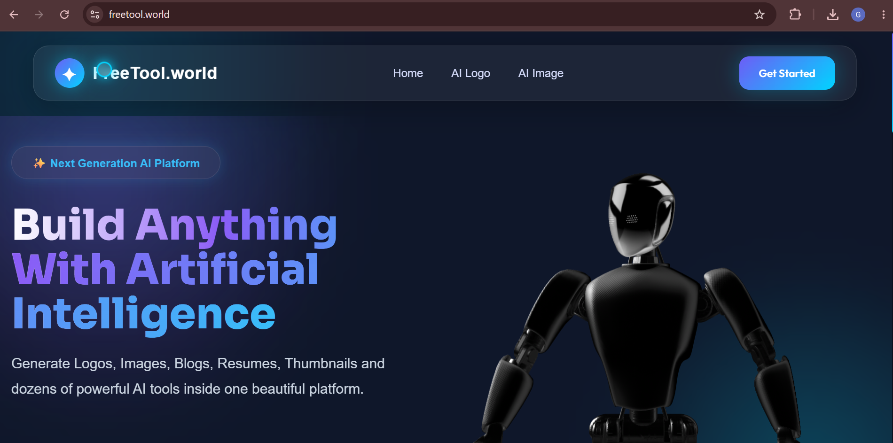
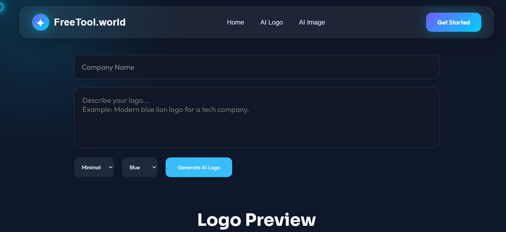
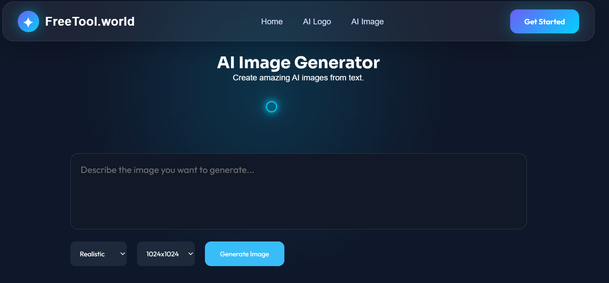
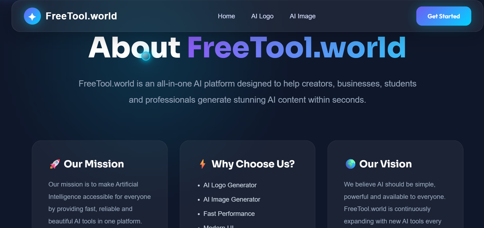
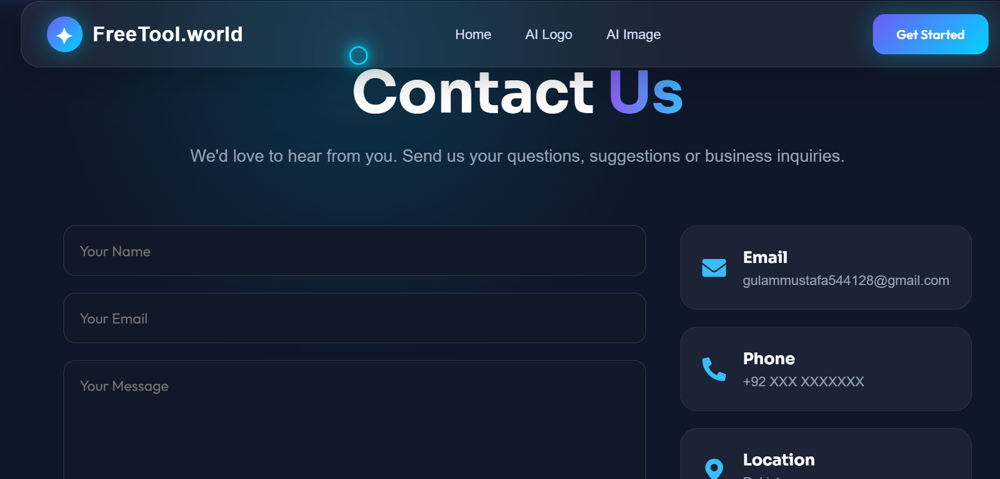

# 🌐 FreeTool.World

An AI-powered platform offering free online tools with a modern, fast, and responsive user experience.

---

## 🚀 Live Demo

🌍 https://freetool.world

---

## ✨ Features

- 🤖 AI Tools
- 🎨 AI Image Generator
- 🖼 AI Logo Generator
- ⚡ Fast & Responsive UI
- 📱 Mobile Friendly
- 🎯 Simple & Clean Design

---

## 🛠 Tech Stack

- React.js
- Vite
- JavaScript
- HTML5
- CSS3
- Git
- GitHub

---

## 📂 Project Structure

```
src/
├── components/
├── pages/
├── assets/
├── App.jsx
└── main.jsx
```

---

## 📦 Installation

```bash
git clone https://github.com/Gulammustafa1-pixel/freetool-world.git

cd freetool-world

npm install

npm run dev
```

---

## 📸 Preview

### 🏠 Home Page



---

### 🎨 AI Logo Generator



---

### 🖼 AI Image Generator



---

### ℹ️ About



---

### 📞 Contact



---

### 📝 Blog


---

## 🎯 Future Improvements

- More AI Tools
- User Authentication
- Dashboard
- Dark Mode
- AI Chatbot
- Performance Improvements

---

## 👨‍💻 Developer

**Gulam Mustafa**

Artificial Intelligence Engineer

Machine Learning | Computer Vision | Python | React

---

## ⭐ Support

If you like this project, please give it a ⭐ on GitHub.
